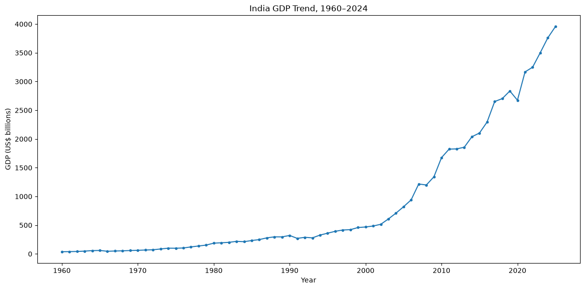
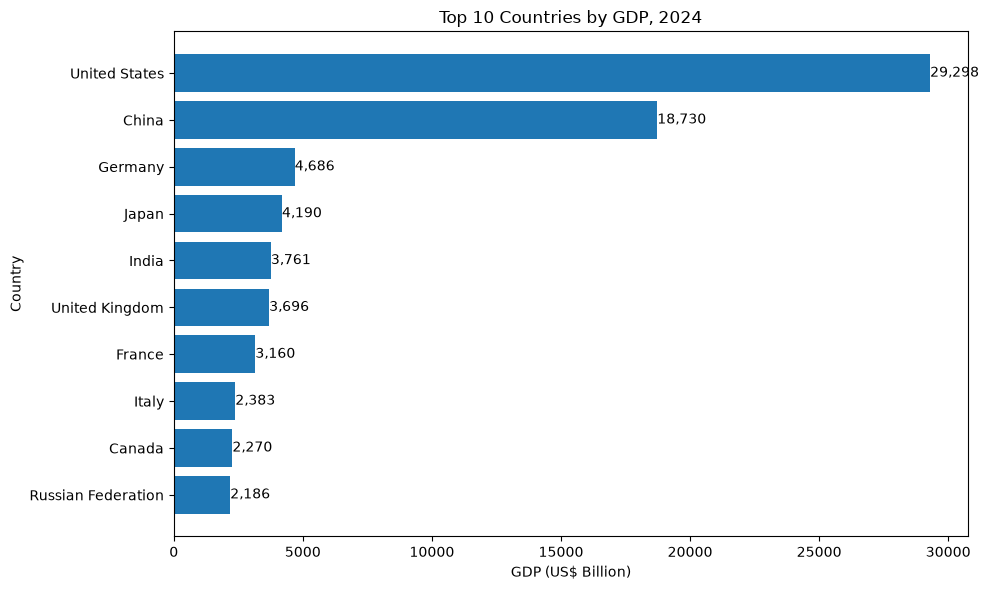
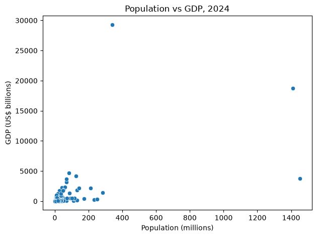
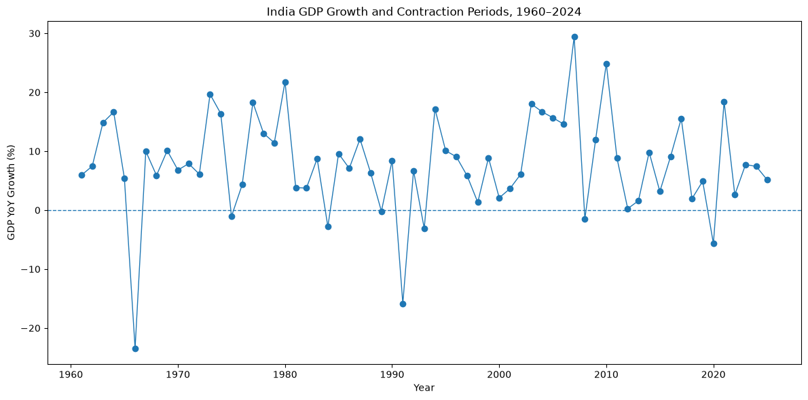

# World Bank Development Analysis

An end-to-end data analytics project using World Bank development data
to examine economic performance, country-level differences, development
indicators, growth patterns, and unusual observations.

The project combines Python, Pandas, NumPy, SciPy, MySQL and data
visualisation to move from raw Excel data through data cleaning and
transformation, relational database analysis, statistical analysis and
business-oriented insights.

## Project Overview

The World Bank dataset contains country-level development indicators
across multiple years. The original workbook is stored in wide format,
with countries and indicators represented across rows and annual
observations represented across columns.

The project focuses on questions such as:

-   Which countries have the largest economies?
-   How has India's GDP changed over time?
-   How does GDP differ across World Bank income groups?
-   How does population relate to total GDP?
-   Does population size correspond to higher GDP per capita?
-   How are GDP per capita, internet usage and life expectancy related?
-   Which countries show unusually high GDP per capita?
-   Which years show unusually large increases or contractions in
    India's GDP?
-   How can SQL window functions, moving averages and year-on-year
    calculations support development analysis?

## Dataset

Source: World Bank Development Indicators (WDI)

Original workbook:

`WDIEXCEL.xlsx`

The workbook contains six sheets. The main `Data` sheet was treated as
the fact table, while `Country` and `Series` were used as
metadata/dimension tables.

### Original Data Characteristics

  Metric                             Value
  ------------------------------ ---------
  Original Data sheet rows         396,970
  Original Data sheet columns           70
  Unique countries                     265
  Unique indicators                  1,498
  Original format                     Wide
  Duplicate rows in Data sheet           0

The first four columns contain identifying information and the remaining
columns contain annual indicator values.

## Data Transformation

The original dataset was converted from wide format to long format using
Pandas `melt()`.

The four identifier columns were retained and the 66 year columns were
transformed into individual observations.

This produced:

-   26,200,020 rows after the wide-to-long transformation
-   9,015,914 non-null country-indicator-year observations
-   17,184,106 rows with empty indicator values that were removed from
    the analytical dataset

This distinction is important: the project did not start with 9 million
rows in the original Excel file. The 9 million figure represents the
useful non-null observations created after reshaping the annual columns
into a long analytical structure.

## Data Preparation

The Python workflow included:

1.  Loading the World Bank Excel workbook with Pandas.
2.  Inspecting sheets, dimensions, data types and missing values.
3.  Checking duplicate records.
4.  Understanding the relationship between country and indicator
    metadata.
5.  Converting the main dataset from wide to long format.
6.  Removing observations where the indicator value was missing.
7.  Preparing country and indicator metadata tables.
8.  Exporting cleaned datasets for SQL analysis.
9.  Validating row counts and data integrity after database loading.

## Data Architecture

The project uses a simple analytical data model:

``` text
                  ┌──────────────────┐
                  │     countries    │
                  ├──────────────────┤
                  │ country_code PK  │
                  │ country_name     │
                  │ region           │
                  │ income_group     │
                  └────────┬─────────┘
                           │
                           │
                           ▼
                  ┌──────────────────┐
                  │   world_bank     │
                  ├──────────────────┤
                  │ country_code PK  │
                  │ indicator_code PK│
                  │ year PK          │
                  │ country_name     │
                  │ indicator_name   │
                  │ value            │
                  └────────┬─────────┘
                           ▲
                           │
                  ┌────────┴─────────┐
                  │    indicators    │
                  ├──────────────────┤
                  │ indicator_code PK│
                  │ indicator_name   │
                  └──────────────────┘
```

The `world_bank` table contains the country-indicator-year observations.

A composite primary key was used:

``` sql
(country_code, indicator_code, year)
```

The cleaned analytical dataset contained 9,015,914 observations after
loading into MySQL.

## SQL Analysis

The SQL stage was used to answer analytical questions and demonstrate
practical SQL skills rather than simply store the cleaned data.

### Indicator Discovery

SQL was used to identify relevant World Bank indicators for:

-   GDP
-   Population
-   Internet usage
-   Life expectancy
-   CO2 emissions
-   Energy
-   Education

### Country-Level Analysis

Examples include:

-   India's historical GDP trend
-   GDP comparisons between India, Australia and New Zealand
-   Countries with the highest and lowest GDP
-   Countries above average GDP
-   Country counts by region and income group

### Economic Group Analysis

The project also analysed:

-   GDP by World Bank income group
-   GDP by region
-   Country distributions across regions and income groups

### Window Functions

SQL window functions were used to perform:

-   `ROW_NUMBER()`
-   `RANK()`
-   `DENSE_RANK()`
-   `LAG()`
-   `LEAD()`

These were applied to country rankings, regional comparisons and
year-over-year analysis.

### Time-Series Analysis

The SQL analysis included:

-   Year-on-year GDP growth
-   Previous-year comparisons using `LAG()`
-   3-year moving averages
-   Regional top-1 and top-3 GDP analysis
-   Trend comparisons across countries

## Python Analysis

Python was used for exploratory analysis, statistical analysis and
visualisation.

Main libraries:

-   Pandas
-   NumPy
-   Matplotlib
-   Seaborn
-   SciPy
-   OpenPyXL
-   SQLAlchemy
-   PyMySQL

### Key Python Analyses

The project includes:

-   2024 GDP ranking
-   India's GDP trend from 1960--2024
-   India's GDP year-on-year growth
-   India's 3-year GDP moving average
-   India vs Australia vs New Zealand GDP comparison
-   Average GDP by World Bank income group
-   Population vs GDP analysis
-   GDP per capita analysis
-   GDP per capita of the 10 most populous countries
-   Correlation analysis
-   Development-indicator heatmap
-   GDP per capita outlier analysis
-   Identification of unusual country/year patterns

## Key Findings

### 1. India's GDP has increased substantially over the long term

India's nominal GDP increased from approximately US\$37 billion in 1960
to approximately US\$3.76 trillion in 2024.

The trend becomes substantially steeper from the early 2000s onward,
with a visible decline around 2020.

Because the analysis uses current US dollars, changes reflect not only
economic growth but also inflation and exchange-rate movements.



### 2. The largest economies are separated by a substantial GDP gap

In the 2024 analysis, the United States recorded approximately US\$29.3
trillion in GDP, followed by China at approximately US\$18.7 trillion.

India ranked fifth in the analysed dataset at approximately US\$3.76
trillion.

The chart illustrates the substantial gap between the two largest
economies and the remaining countries in the top 10.



### 3. Population size does not directly translate into higher GDP per capita

The comparison of the 10 most populous countries in 2024 shows large
differences in GDP per capita.

For example, countries with similarly large populations can have
materially different GDP per capita values. Population therefore
provides scale, but it does not by itself explain the level of economic
output per person.


### 4. Population and total GDP have a moderate positive relationship

The 2024 population-versus-GDP analysis shows a moderate positive
relationship between population and total GDP.

This is intuitive at an aggregate level: larger populations can
contribute to larger overall economic output. However, the relationship
is not strong enough to imply that population alone determines GDP.



### 5. Development indicators show stronger relationships at the per-capita level

The correlation analysis showed:

-   Population vs GDP: approximately 0.55
-   GDP per capita vs internet usage: approximately 0.47
-   GDP per capita vs life expectancy: approximately 0.59
-   Internet usage vs life expectancy: approximately 0.82

These are correlations within the analysed 2024 country dataset. They
describe association, not causation.


### 6. India's GDP growth varies considerably across years

India's year-on-year GDP calculations show substantial variation across
the 1960--2024 period.

The highest recorded GDP growth in this dataset occurred in 2007 at
approximately 29.4%.

The largest contraction occurred in 1966 at approximately -23.5%.

These values are based on changes in nominal GDP measured in current US
dollars, so they should not be interpreted as real GDP growth rates.



### 7. GDP per capita outliers highlight unusually high-income economies

The IQR-based outlier analysis identified a small group of economies
with unusually high GDP per capita relative to the overall distribution.

This provides a useful example of how statistical techniques can be used
to identify observations that warrant further investigation rather than
treating them automatically as errors.

## Visualisations

The project includes analytical charts covering:

  -----------------------------------------------------------------------
  Analysis                            Visualisation
  ----------------------------------- -----------------------------------
  2024 GDP ranking                    Top 10 countries by GDP

  Long-term trend                     India GDP, 1960--2024

  Economic comparison                 India vs Australia vs New Zealand

  Population analysis                 Population vs GDP, 2024

  Development indicators              Correlation heatmap

  Population and living standards     GDP per capita of the 10 most
                                      populous countries

  Growth analysis                     India GDP year-on-year growth

  Smoothing                           India GDP vs 3-year moving average

  Income analysis                     Average GDP by World Bank income
                                      group

  Anomaly analysis                    GDP per capita outliers
  -----------------------------------------------------------------------

## SQL Techniques Demonstrated

``` text
SELECT
WHERE
GROUP BY
HAVING
ORDER BY
JOIN
CTE
CASE
Subqueries
Aggregate functions
ROW_NUMBER()
RANK()
DENSE_RANK()
LAG()
LEAD()
Window functions
Moving averages
Year-on-year calculations
```

## Python Techniques Demonstrated

``` text
Pandas data loading
DataFrame exploration
Missing-value analysis
Duplicate checks
Data reshaping with melt()
DataFrame merge()
GroupBy analysis
Sorting and ranking
pct_change()
Rolling averages
Correlation analysis
Pearson correlation
IQR-based outlier detection
Matplotlib
Seaborn
```

## Project Structure

``` text
WORLD_BANK_DATASET_ANALYSIS/
│
├── data/
│   ├── raw/
│   └── cleaned/
│
├── notebooks/
│   ├── 01_data_import_and_exploration.ipynb
│   ├── 02_data_cleaning_and_transformation.ipynb
│   └── 04_data_visualization.ipynb
│
├── sql_queries/
│   ├── 01_db_setup.sql
│   ├── 02_data_import.sql
│   ├── 03_data_validation.sql
│   ├── 04_indicators_discovery.sql
│   ├── 05_country_analysis.sql
│   ├── 06_business_analysis.sql
│   └── 07_window_functions.sql
│
├── documentation/
│   └── project_documentation.docx
│
├── visualisations/
│   ├── india_gdp_trend.png
│   ├── top_10_gdp_2024.png
│   ├── gdp_per_capita_top_10_populous.png
│   ├── population_vs_gdp_2024.png
│   ├── development_indicator_correlation.png
│   └── india_gdp_growth.png
│
└── README.md
```

## How to Run

### 1. Clone the repository

``` bash
git clone https://github.com/navyatharai1996/world_bank_development_analysis.git
cd world_bank_development_analysis
```

### 2. Create and activate a virtual environment

``` bash
python -m venv .venv
```

Windows:

``` bash
.venv\Scripts\activate
```

### 3. Install dependencies

``` bash
pip install pandas numpy matplotlib seaborn scipy openpyxl pymysql sqlalchemy
```

### 4. Run the Python notebooks

Open the notebooks in VS Code or Jupyter and run the data import,
cleaning/transformation and visualisation workflows.

### 5. Set up MySQL

Create the `world_bank_database` database and execute the SQL scripts in
sequence:

``` text
01_db_setup.sql
02_data_import.sql
03_data_validation.sql
04_indicators_discovery.sql
05_country_analysis.sql
06_business_analysis.sql
07_window_functions.sql
```

The cleaned long-format dataset is intentionally not stored directly in
GitHub because of its large size.

## Analytical Limitations

The project uses nominal/current US dollar GDP for several analyses.
Therefore, changes in GDP can reflect inflation and exchange-rate
movements in addition to changes in real economic activity.

Correlation results identify statistical association and should not be
interpreted as causal relationships.

World Bank aggregates and records with missing metadata were filtered
where required for specific country-level analyses.

GDP per capita outliers were identified statistically using an IQR-based
approach; an outlier is not automatically a data error.

## Skills Demonstrated

This project demonstrates an end-to-end analytics workflow:

``` text
Raw Excel Data
      ↓
Data Exploration
      ↓
Data Quality Checks
      ↓
Wide → Long Transformation
      ↓
Clean Analytical Dataset
      ↓
MySQL Data Model
      ↓
SQL Analysis
      ↓
Python Statistical Analysis
      ↓
Visualisation
      ↓
Business / Development Insights
```

The project demonstrates practical experience working with a large
analytical dataset, relational data modelling, SQL analysis,
Python-based exploratory and statistical analysis, time-series
techniques, data visualisation and translating quantitative results into
interpretable findings.